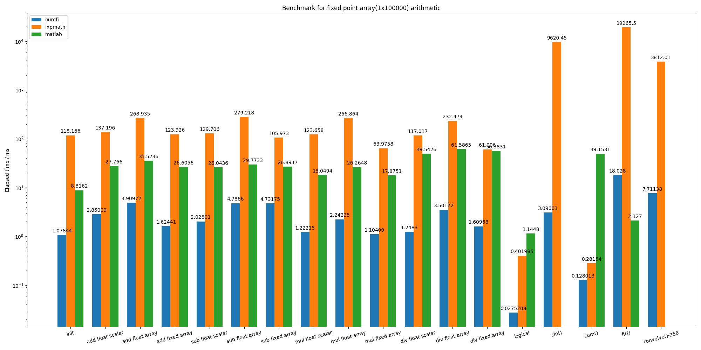

# [numfi](https://github.com/ZZZZzzzzac/numfi)
numfi is a numpy.ndarray subclass that does fixed-point arithmetic.

Feature:  

- Automatically perform fixed-point arithmetic through overloaded operators  

- Maximum compatibility with numpy and other library, just like a normal numpy.ndarray  

- Optimized calculation speed by minimizing quantization as much as possible   

## Install
**Prerequisite**: python3 and numpy

```
pip install numfi
```
or you can just copy [numfi.py](https://github.com/ZZZZzzzzac/numfi/blob/master/numfi/numfi.py) and do whatever you want, after all it's only 200 lines of code

## Quick start
```python
from numfi import numfi

# numfi(array=[], signed=1, bits_word=32, bits_frac=16, rounding='round', overflow='wrap')
x = numfi(np.random.rand(3),1,16,8) 
# numfi.__repr__() return brief description of numfi object: x => s16/8-r/s
# s for 'signed', followed by word bits and fraction bits, r/s for 'round' and 'saturate` for rounding/overflow method

# any arithmetic operation with numfi will return a numfi object with proper precision and value
# By overloading operators, numfi object can do fixed-point arithmetic easily:
y = x + 1
y = [1] - x
y = x * np.random.rand(3)
y = numfi([1,0,0.1234],1,21,15) / x
y = -x
y = x ** 0.5
y = x % 3
y = x & 0b101
y = x | 0b100
y = x ^ 0b001
y = x << 4
y = x >> 2
y = x > 0.5
y = x >= 0.5
y = x == x
y = x <= np.ones(3)
y = x < [1,1,1]
...

# By inheriting from numpy.ndarray, numfi object can be used just like normal numpy array, and return same numfi object back
y = np.sin(x)
y = x[x>1]
y = x.sum()
y = x.reshape(3,1)
plt.plot(x)
pandas.DataFrame(x)
numpy.convolve(x,np.ones(4))
numpy.fft.fft(x,n=512)
for i in x:
    print(i)
...
```
## Document
Details can be found here: [https://numfi.readthedocs.io/en/latest/?](https://numfi.readthedocs.io/en/latest/?)

## License
The project is licensed under the MIT license.

## [Benchmark](https://github.com/ZZZZzzzzac/numfi/blob/master/benchmark.ipynb)

